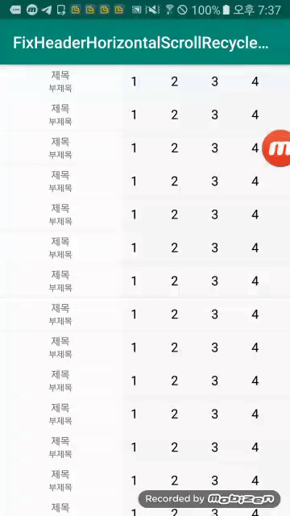

# FixHeaderHorizontalScrollRecyclerview

## 소개
기존 RecyclerView에 재 사용성을 유지하면 

아이템 스크롤이 가능한 프로젝트 입니다. 

Observer를 이용해 구현 했습니다.

## OverScroll 제거
기능을 활성화 하고 싶으시면
item_content.xml 
android:overScrollMode="never"

